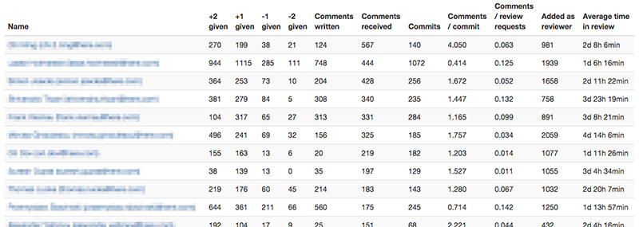
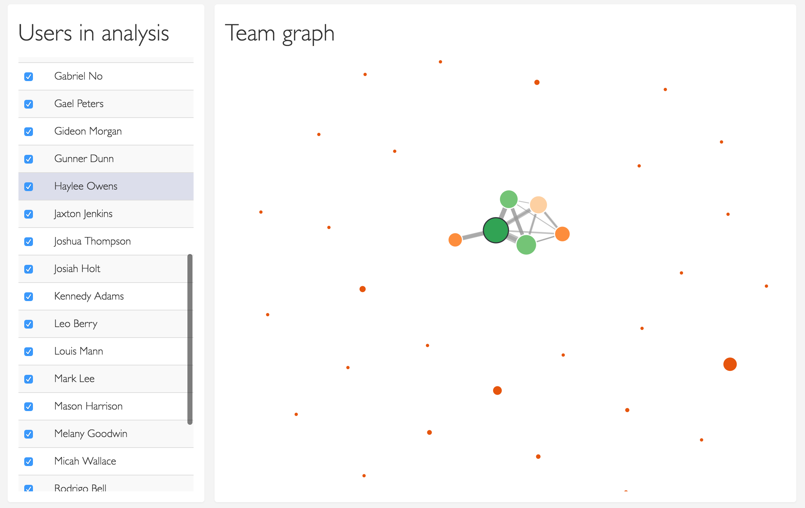
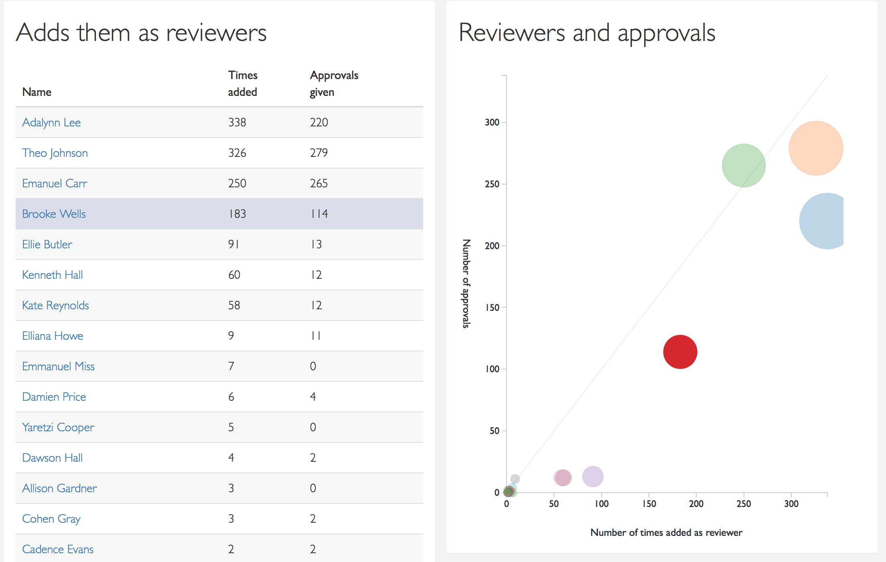
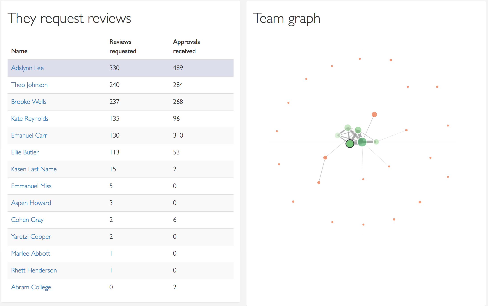
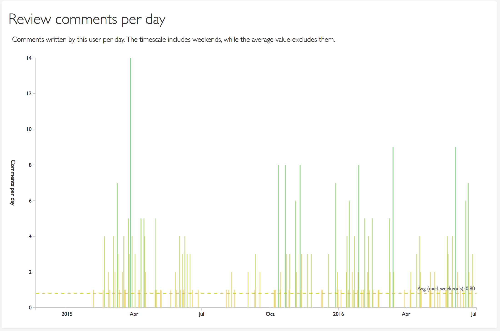
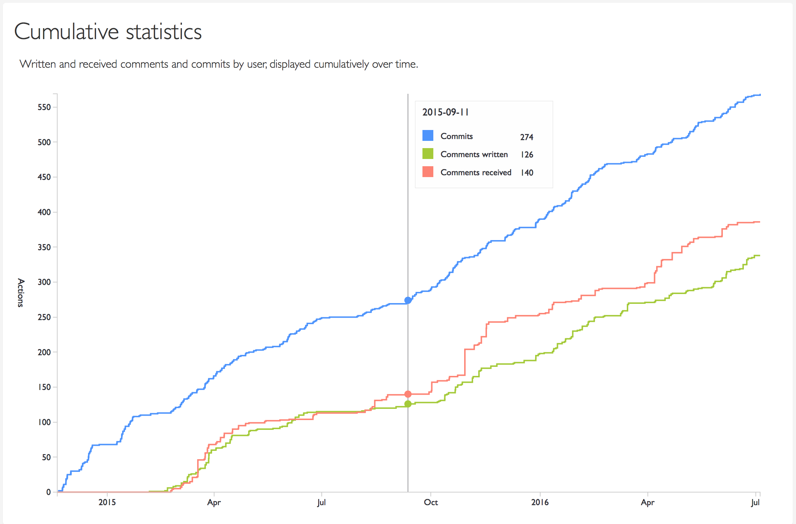
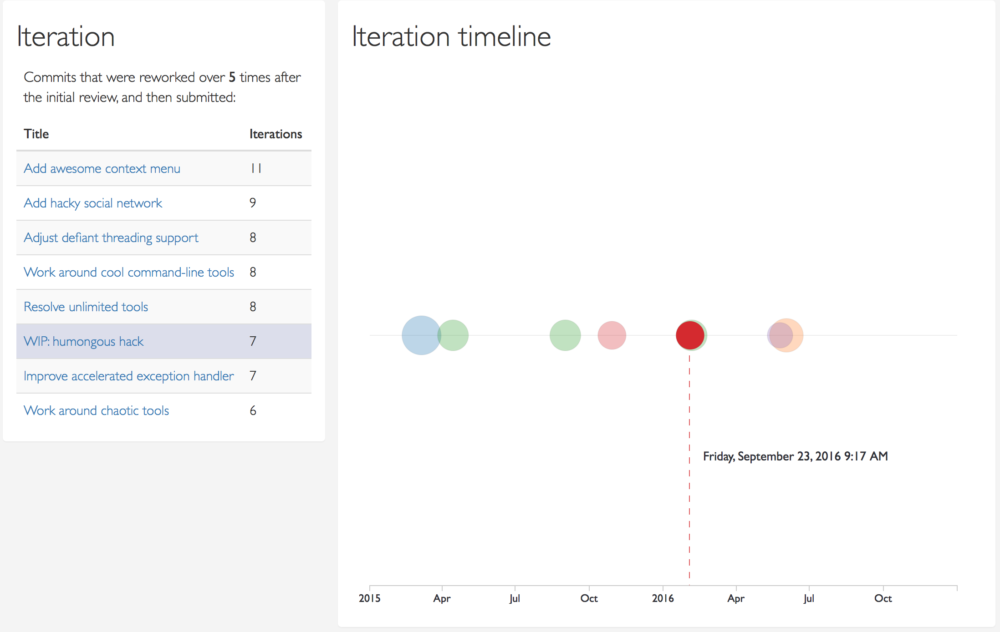

# MAINTENANCE

TL;DR: This tool is unmaintained.

If you need a GitHub version of this tool, go to https://github.com/holmari/repostats .

I originally built this tool in my spare time while working for Nokia, my former employer.
Gerrit is an awesome code review tool, but I have not used Gerrit at work for several years.

I rewrote GerritStats in early 2021 so it works for GitHub - https://github.com/holmari/repostats .
Its initial version does not have support for Gerrit, but it's designed in a way that it's easy to
extend to include support for Gerrit's REST API. A bit of TypeScript needs to be written to make
the data loading and analysis for Gerrit analysis and connectivity work. PRs very much accepted!

# GerritStats

This project provides tools to display statistics from a Gerrit repository.
It generates output in HTML format.

The tool can be useful for analysing how efficiently code reviews are implemented in an organization,
and what kind of virtual teams are formed in the review process.

The tool will generate a set of HTML files that include graphs and charts, such as
a proximity graph of the developers, based on how many review comments they write to each other,
as well as a per-developer page that lists all their review comments and links back to the reviews.

There are two separate command-line tools:

* GerritDownloader, which downloads JSON data from the server
* GerritStats, which parses the json output provided by GerritDownloader, and generates HTML output.

## Demo

A demo of the resulting HTML output is available at:

http://gerritstats-demo.firebaseapp.com

## How to build

The tool should work fine on OS X and Linux. Windows is not supported; if it works, it's not intended.

Java 8 is required.

```
# Prerequisite: if using OS X, install brew from http://brew.sh

brew install npm # or, if not using OS X, install npm some other way

./gradlew assemble
```

## How to execute

```
./gerrit_downloader.sh
```

Lists all command line options for the data download tool.

```
./gerrit_stats.sh
```

Lists all command line options for the statistics generator.

## How to execute: saving data locally

Fetching data from Gerrit can take a while. Use GerritDownloader to get the JSON output from the server so that you can parse it later:

```
./gerrit_downloader.sh --server gerrit.instance.on.inter.nets --project YourProjectName --limit 7500 --output-dir gerrit_out/
```

The above command will download all data from the given Gerrit server and given project, and store the data in .json format in the given output directory.

If you have multiple projects in Gerrit and want to take a look at all the data, omit the --project argument. This will download data for all projects you have
access to:

```
./gerrit_downloader.sh --server gerrit.instance.on.inter.nets --output-dir gerrit_out/
```

## How to execute

Once you have the data, generate HTML output like so:

```
./gerrit_stats.sh -f gerrit_out/
```

You can also pass several other arguments, like pointing to a specific file, or including only a subset of
developers.

```
./gerrit_stats.sh --file gerrit-json-out.txt --branches master --include developer1@domain.com,developer2@domain.com,...developer5@domain.com --list-commits-exceeding-patch-set-count 5
```

## How to develop the UI

 1. ./gradlew assemble (or use e.g. IntelliJ to build)
 2. cd GerritStats && npm run generateData -- -f your_data_file.json
 3. npm run webpack-watch
 4. Open the output in GerritStats/out-html and start development.

## Screenshots

A fully functional demo can be found at http://gerritstats-demo.firebaseapp.com but there are some screenshots below that illustrate what this tool provides.

The index page will provide you with a sortable overview table of some of the core statistics:



In the overview page, you can also uncheck some users, like bots, so that they're excluded from the analysis.

The index page also contains a graph that illustrates how developers are connected to each other:



The Profile page contains detailed information about the selected user. Apart from some basic numbers also visible on the overview, there's several charts and graphs, illustrating how reviews are done by and for this person.

There's a chart and a table showing who this user adds as a reviewer, and how often they approve the changes:



A team graph, centered around this user, shows with whom the reviews are done with, and how strong the relations between others in the team are:





There's a chart showing cumulative statistics of commits, and how many comments were written or received over time:



There's also a chart that shows commits in which the user iterated, got reviews, and iterated some more - a highly time-consuming activity for all parties:



Apart from these, there's many other bits of data being shown, so take a look at the demo app linked above!
