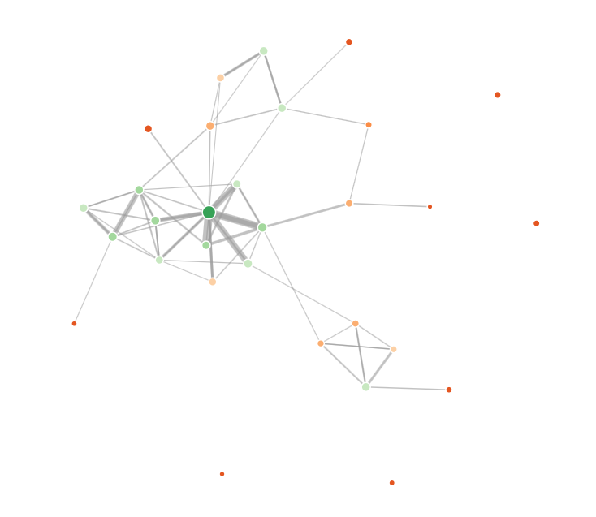
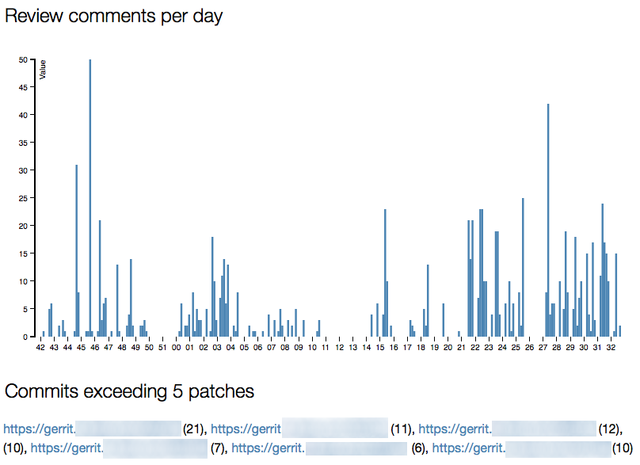

# GerritStats

This project provides tools to display statistics from a Gerrit repository.
It generates output in HTML format.

The tool can be useful for analysing how efficiently code reviews are implemented in an organization,
and what kind of virtual teams are formed in the review process.

The tool will generate a set of HTML files that include graphs and charts, such as
a proximity graph of the developers, based on how many review comments they write to each other,
as well as a per-developer page that lists all their review comments and links back to the reviews.

There are two separate command-line tools:

* GerritDownloader, which downloads JSON data from the server
* GerritStats, which parses the json output provided by GerritDownloader, and generates HTML output.

## Demo

A demo of the resulting HTML output is available at:

http://gerritstats-demo.firebaseapp.com

## How to build

The tool should work fine on OS X and Linux. Windows is not supported; if it works, it's not intended.

```
# Prerequisite: if using OS X, install brew from http://brew.sh

brew install npm # or, if not using OS X, install npm some other way

./gradlew assemble
```

## How to execute

```
./gerrit_downloader.sh

```

Lists all command line options for the data download tool.

```
./gerrit_stats.sh
```

Lists all command line options for the statistics generator.

## How to execute: saving data locally

Fetching data from Gerrit can take a while. Use GerritDownloader to get the JSON output from the server so that you can parse it later:

```
./gerrit_downloader.sh --server gerrit.instance.on.inter.nets --project YourProjectName --limit 7500 --output-dir gerrit_out/
```

The above command will download all data from the given Gerrit server and given project, and store the data in .json format in the given output directory.

If you have multiple projects in Gerrit and want to take a look at all the data, omit the --project argument. This will download data for all projects you have
access to:

```
./gerrit_downloader.sh --server gerrit.instance.on.inter.nets --output-dir gerrit_out/
```

## How to execute

Once you have the data, generate HTML output like so:

```
./gerrit_stats.sh -f gerrit_out/
```

You can also pass several other arguments, like pointing to a specific file, or including only a subset of
developers.

```
./gerrit_stats.sh --file gerrit-json-out.txt --branches master --include developer1@domain.com,developer2@domain.com,...developer5@domain.com --list-commits-exceeding-patch-set-count 5
```

The index page will provide you with a sortable overview table of some of the core statistics:


The index page also contais a graph that illustrates how developers are connected to each other:



And on the per-person page, you'll see a chart of review comments per day, a configurable
list of commits that have a high number of patch sets, and many graphs:


